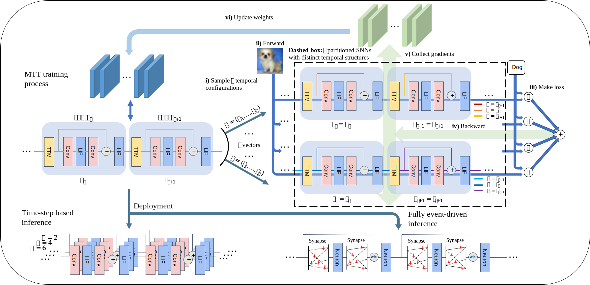

# Temporal Flexibility in Spiking Neural Networks: Towards Generalization Across Time Steps and Deployment Friendliness

## Requirements

The minimum version known to work well:

- PyTorch 1.11.0
- CUDA 11.3
- Python 3.8

Code repo in process of organizing.
